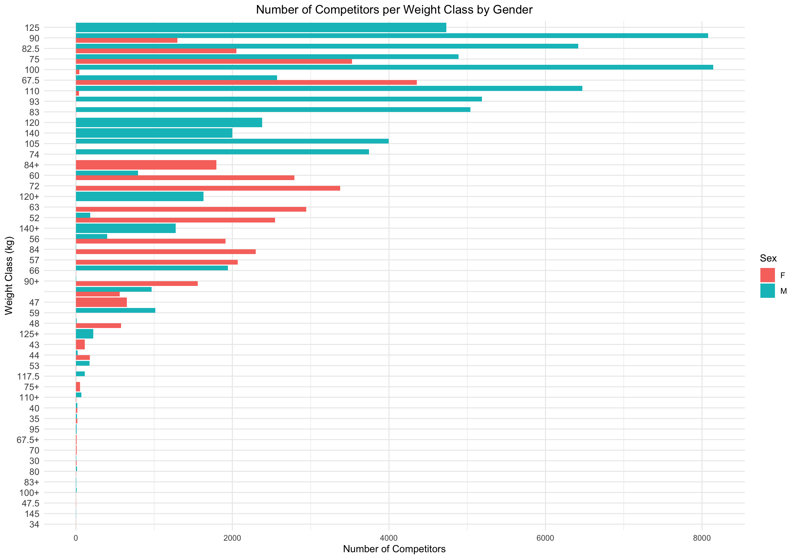

# Powerlifting Performance Analysis: Age Group and Weight Class Insights

## Project Overview
This project aims to analyze powerlifting performance data to uncover insights into how various factors such as age, weight class, and gender influence competitive outcomes. The analysis involves exploring the dataset for trends, comparisons, and significant differences in lifting performance across different categories.

## Data Acquisition
The data used in this project is sourced from the [Open Powerlifting dataset](https://www.kaggle.com/datasets/ashley93/openpowerlifting), which is accessible via the Kaggle API. The API provides an automated way to download datasets, and the `kaggler` R package was used to facilitate this process.

## Data Preparation

1. **Data Loading:**
   - The dataset is downloaded using the Kaggle API and read into R using the `read.csv` function.

2. **Data Cleaning:**
   - Selected columns: `Name`, `Sex`, `Age`, `Division`, `BodyweightKg`, `WeightClassKg`, `BestSquatKg`, `BestBenchKg`, `BestDeadliftKg`, `TotalKg`, and `Place`.
   - NA values are filtered out to ensure the accuracy of the analysis.

3. **Age Group Classification:**
   - Lifters are categorized into age groups: Teen, Open, Master 40-59, and Master 60+.

## Analysis

1. **Competitor Distribution:**
   - **Weight Class Counts:** Visualized using bar charts to show the number of competitors in each weight class, separated by gender.
     
 

   - **Highest and Lowest Competitor Counts:** Identified the weight classes with the highest and lowest number of competitors for both males and females.
     
     ```
     Weight Class Statistics

       Male
      
      | Metric             | WeightClassKg | Count |
      |--------------------|---------------|-------|
      | Highest Count      | 100           | 8142  |
      | Lowest Count       | 63            | 1     |
      
       Female
      
      | Metric             | WeightClassKg | Count |
      |--------------------|---------------|-------|
      | Highest Count      | 67.5          | 4357  |
      | Lowest Count       | 100+          | 1     |
     
     ```
2. **Performance Comparison by Age Group:**
   - **Box Plots:** Show the total weight distribution lifted across different age groups, with mean values annotated.
  


## Results


